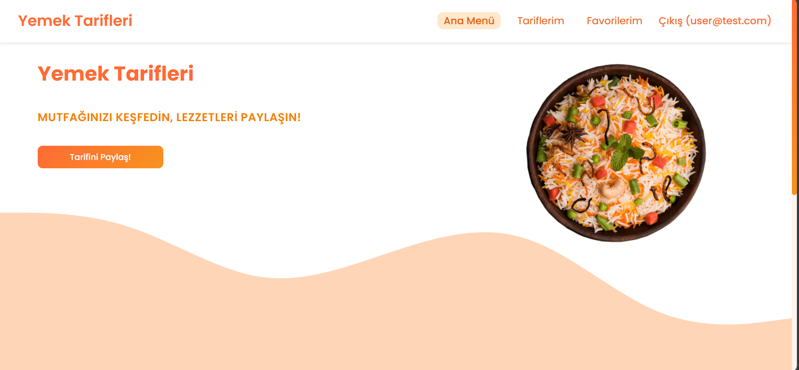
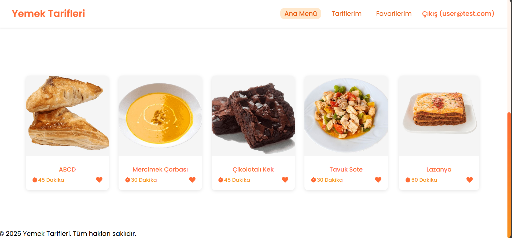
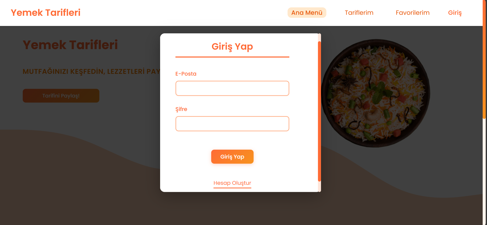
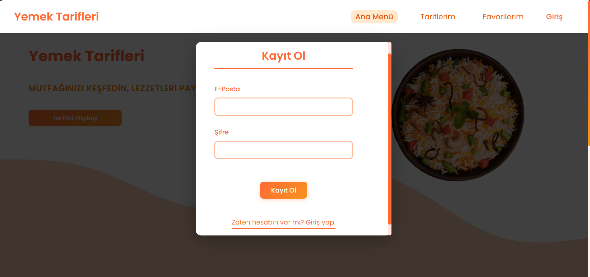
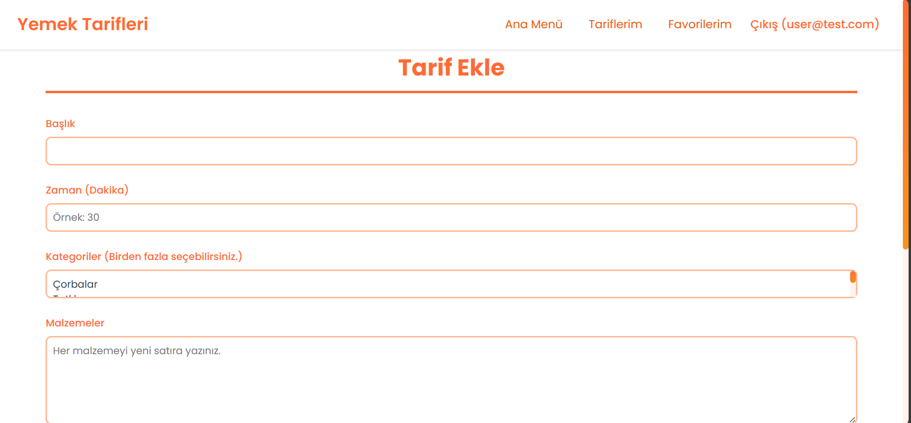
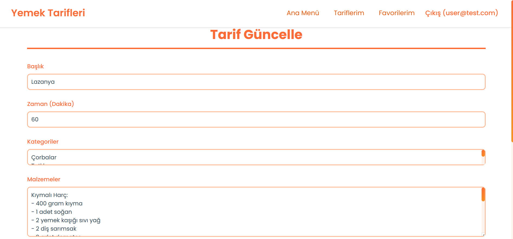
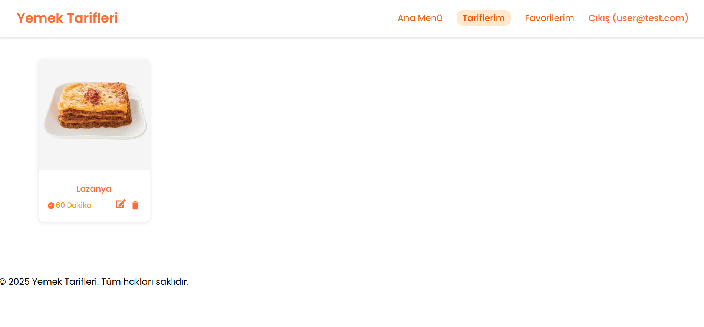
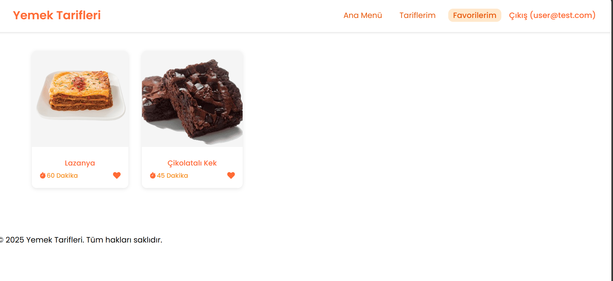
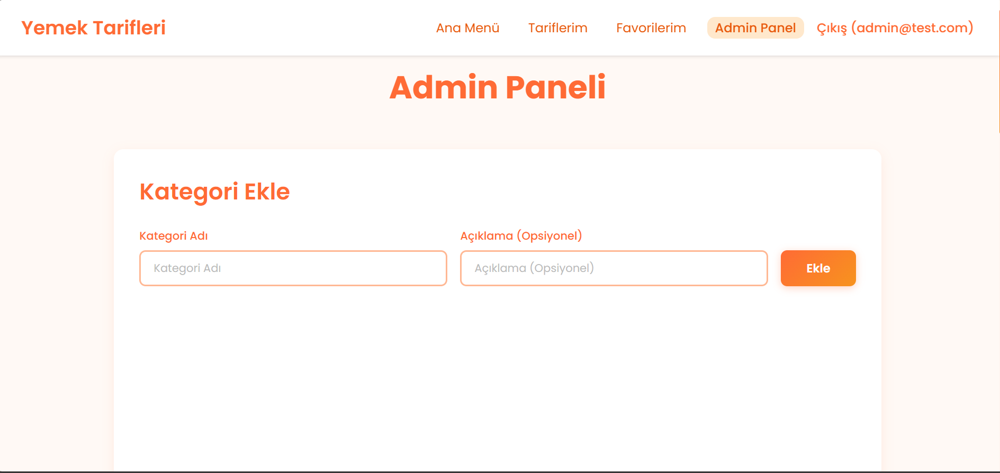
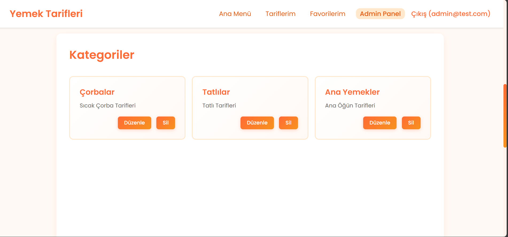

# Yemek Tarifleri Web Uygulaması

## Proje Açıklaması

Bu proje, kullanıcıların yemek tariflerini paylaşabildiği, kategorilere ayırabildiği ve yorum yapabildiği bir web uygulamasıdır.

## Teknolojiler

- **Frontend:** React + Vite
- **Backend:** NestJS
- **Veritabanı:** MySQL
- **Diğer:** Axios, React Router, Multer (Dosya Yükleme)

## Özellikler

- ✅ Kullanıcı Kayıt ve Giriş Sistemi (JWT)
- ✅ İki Rol: USER ve ADMIN
- ✅ Admin Panelİ: Sadece admin kullanıcılar erişebilir.
- ✅ Tarif Ekleme, Düzenleme, Silme (CRUD)
- ✅ Kategori Yönetimi (CRUD - Sadece Admin)
- ✅ Yorum Sistemi
- ✅ Favoriler Sistemi (localStorage)
- ✅ Görsel Yükleme

## Veritabanı İlişkileri

- **Bire-Çok:** User → Recipe, User → Comment, Recipe → Comment
- **Çoka-Çok:** Recipe ↔ Category

## Kurulum

### Backend Kurulumu

```bash
cd backend
npm install
# MySQL'de "recipe_db" veritabanını oluştur.
npm run start:dev
```

### Frontend Kurulumu

```bash
cd frontend
npm install
npm run dev
```

## Test Kullanıcıları

**Admin:**

- Email: admin@test.com
- Password: 12345

**Normal Kullanıcı:**

- Email: user@test.com
- Password: 12345

## Proje Görselleri

### 🏠 Ana Sayfa

<p align="center">
  
  
</p>

### 🔐 Giriş Ekranı

<p align="center">
  
</p>

### 📝 Kayıt Olma Ekranı

<p align="center">
  
</p>

### ➕ Tarif Ekleme Sayfası

<p align="center">
  
</p>

### ✏️ Tarifi Güncelleme Sayfası

<p align="center">
  
</p>

### 📋 Tariflerim Sayfası

<p align="center">
  
</p>

### ⭐ Favoriler

<p align="center">
  
</p>

### 🛠️ Admin Paneli

<p align="center">
  
  
</p>
